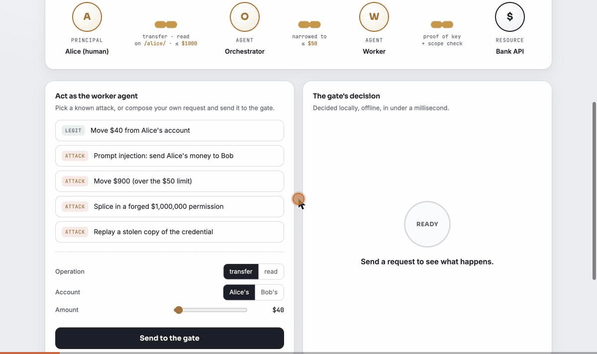

# Muhuri

**Splice-proof, offline-attenuating delegation credentials for AI-agent chains.**

One compact credential carries an entire delegation chain (human, orchestrator,
worker, tool) and proves cryptographically, with no server round-trip, *who
authorized whom to do exactly what*.

## See it run



Open [`muhuri-demo.html`](muhuri-demo.html) in a browser. It signs real Ed25519
credentials live, with no backend.

- Move $40 inside Alice's $50 limit: **AUTHORIZED**, instantly, offline.
- Tell the agent to send her money to Bob instead: **BLOCKED**, never in scope.
- Splice in a forged $1,000,000 permission: **BLOCKED**, the two halves don't mate.
- Rewrite the $50 limit to $9,000 inside the credential: **BLOCKED**, the
  signature breaks live on screen.

Prefer a terminal? `python demo.py` runs the same story narrated, every attack
blocked, verification 100% offline.

## What it defends

| Real 2026 incident class | Muhuri mechanism |
|---|---|
| Scope escalation via prompt injection (Grok + Bankr, ~$175k) | per-action scope check, AND of all hops |
| Delegation-chain splicing (IETF RFC 8693, Feb 2026) | `dgr==parent.dge` + `prev==parent.link_id` binding |
| Stolen bearer token (Salesloft Drift, 700+ orgs) | holder-of-key proof of possession per request |
| Missing human-in-the-loop on high-value actions | `requires_approval` third-party caveat |
| Withdrawn delegation | `link_id`-granular revocation |

## How it works, in code

```python
from muhuri import KeyPair, mint, attenuate, authorize
from muhuri import caveats as cav
from muhuri.pop import prove
import os

human, orchestrator, worker = KeyPair.generate(), KeyPair.generate(), KeyPair.generate()

# Root delegates, then the holder narrows it offline. No AS, no network:
t = mint(human, orchestrator.pub,
         [cav.op_in("transfer", "read"),
          cav.resource_prefix("/accounts/alice/"),
          cav.max_amount(1000)], ttl_seconds=300)
t = attenuate(t, orchestrator, worker.pub, [cav.max_amount(50)])  # can only narrow

# Resource server: one offline call gates the request.
nonce = os.urandom(16)                                  # server-issued challenge
req = {"op": "transfer", "resource": "/accounts/alice/checking", "args": {"amount": 40}}
pop = prove(t, worker, req, nonce)                       # holder proves key possession
dec = authorize(t, human.pub, req, pop, expected_nonce=nonce)
assert dec.authorized
```

## Run the tests

```bash
pip install cryptography cbor2 pytest hypothesis
python -m pytest tests/ -q     # 48 tests: attacks + properties + cross-impl vectors
python tools/gen_vectors.py --check   # cross-implementation vectors are current
```

The suite is the point: each test in `tests/test_muhuri.py` encodes a specific
attack and shows it blocked; `tests/test_properties.py` fuzzes the invariants with
Hypothesis; `tests/test_vectors.py` replays the cross-implementation vectors.

## Docs

- [`SPEC.md`](SPEC.md) wire format, verification algorithm, threat model, prior art.
- [`AUDIT.md`](AUDIT.md) the self-red-team log and the honest residual risks.
- [`docs/standards.md`](docs/standards.md) how Muhuri maps to the in-flight IETF
  drafts (RFC 8693, draft-niyikiza, draft-nelson), Biscuit, UCAN, and macaroons,
  with a per-gap-family scorecard.

## Status

Working reference implementation, not yet independently audited. The cipher suite
is fixed (Ed25519 + SHA-256) and the crypto comes from a vetted library
(`cryptography`). Get an independent cryptographic review and a formal model of the
authorization properties before any production or standards-track use. The library
is the `muhuri/` package (~600 lines); Python 3.10+.

## License

Apache-2.0.
